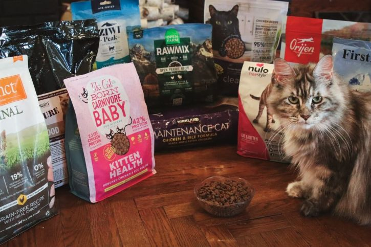

## Tutorials

Learn how to use the MeowTrition API with practical, step-by-step guides.

---

## What you'll learn

These tutorials show you how to:

- Filter foods by specific criteria
- Compare nutritional profiles
- Find foods for special dietary needs
- Add, update, or delete food products, only available to admins
- Make informed decisions about cat nutrition
  